# Semiautomatische Aufbereitung der Sitzungstitel in den Zürcher Ratsmanualen

Inhaltsverzeichnis

-   [Projekt Ratsmanuale](#projekt-ratsmanuale)
-   [Sitzungstitel̈](#sitzungstitel)
-   [Ziele](#ziele)
-   [Tools](#tools)
-   [Vorgehen](#vorgehen)
  

## Projekt Ratsmanuale

  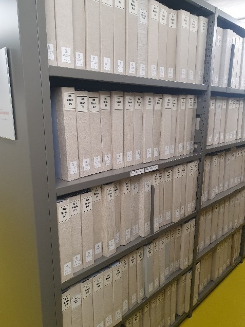
  
  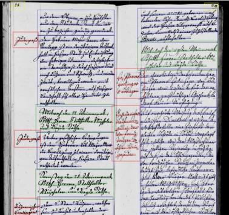
  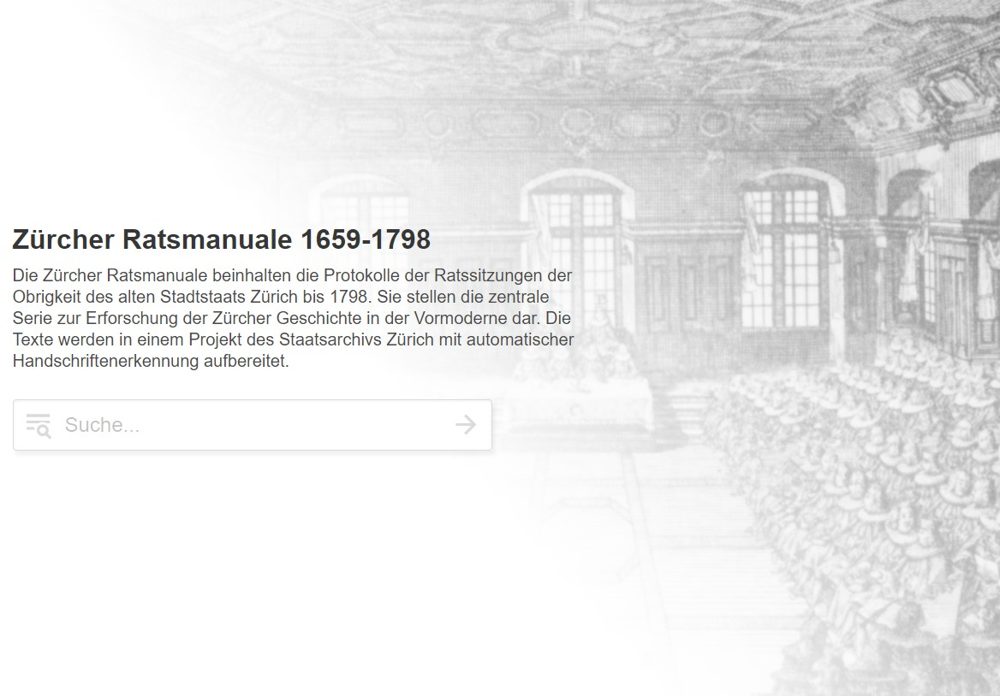

Die Zürcher Ratsmanuale beinhalten die Protokolle der Ratssitzungen der Obrigkeit des alten Stadtstaats Zürich (1484 - 1798). Das Projekt Ratsmanuele startete 2019 als Pilot in der Abteilung Nacherschliessung und Digitalisierung des Staatsarchivs Zürich, um...

- einen zentralen Bestand der frühen Neuzeit in Zürich für die historische Forschung und der interessienten Öffentlichkeit im Volltext online zur Verfügung zu stellen.
- die neuen Möglichkeiten mit KI bzw. automatischer Handschriftenerkennung (HTR) mit [Transkribus](https://www.transkribus.org/de) zu erproben.
- Methoden und Scripts bzw. Best Practices zu entwickeln, die auf weitere Projekte in der Abteilung Nacherschliessung und Digitalisierung des Staatsarchivs des Kantons Zürich übertragen werden können.

Am Ende des Pilotprojekts 2022 konnten sämtliche Protokolle des 18. Jahrhunderts publiziert werden. 2023 startete die Aufbereitung der restlichen Ratsmanual-Bände - nun als reguläres Projekt.

[Hier](https://ratsmanuale-zuerich.transkribus.eu/) geht es zum Portal, auf welchem du weitere Informationen zum Projekt findest. 

## Sitzungstitel

Eine Auswertung der Bände ergab, dass die Schreiber während über 300 Jahren bei der Aufzeichnung der Sitzungstitel dieselbe Konvention beizubehalten schienen: 

🔴 1. Datum der Sitzung
  
🔵 2. Vorsitzender

🟢 3. tagendes Gremium

Hier Beispiele aus dem ersten, letzten und einem weiteren Band:

  <table>
    <tr>
      <td style="border: 2px solid black;">
        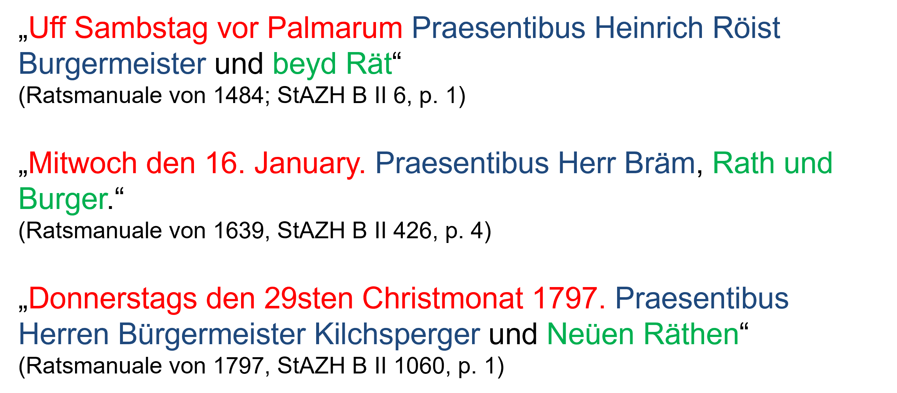
      </td>
    </tr>
  </table>

## Ziele

Wir möchten...
1. die Ratsmanuale im Archivkatalog zusätzlich auf Stufe Sitzung erschliessen.
2. strukturierte und standardisierte Daten erhalten und diese als OGD zur Verfügung stellen.
3. die Daten mit Normdaten wie der [Gemeinsamen Normdatei](https://www.dnb.de/DE/Professionell/Standardisierung/GND/gnd_node.html) anreichern.

Konkret wollen wir am Schluss folgende Daten erhalten:

  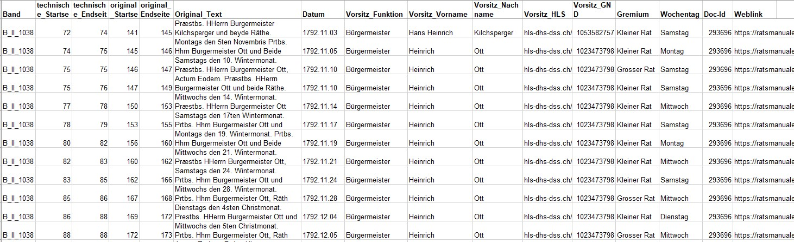

Mit diesen Daten wollen wir einerseits neue Verzeichniseinheiten in unserem Archivkatalog generieren ([hier](https://suche.staatsarchiv.djiktzh.ch/detail.aspx?ID=5122678) ein Beispiel einer Verzeichniseinheit):

  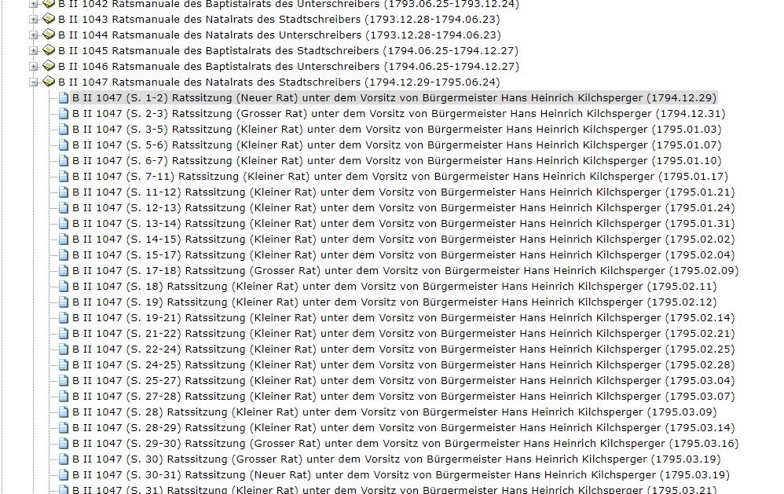

Andererseits möchten wir zu einem späteren Zeitpunkt (wenn genug Daten zusammengekommen sind) für statistische Auswertungen einen OGD-Datensatz erstellen. Hier bereits eine erste Auswertung der Anzahl Sitzungen je Gremium und Wochentag der aufbereiteten Bände von 1792 - 1798:

  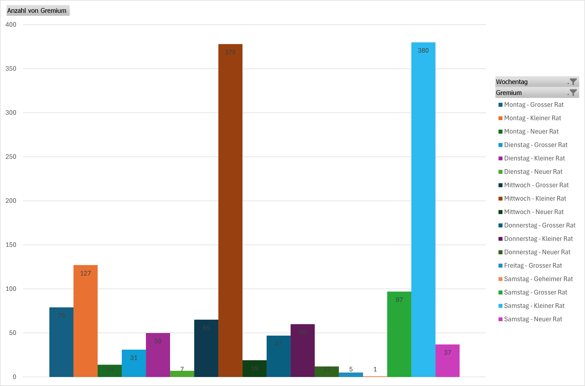

Zudem möchten wir die Daten mit unserer [Transkribus Schnittstelle](#transkribus-schnittstelle) reimportieren: 

  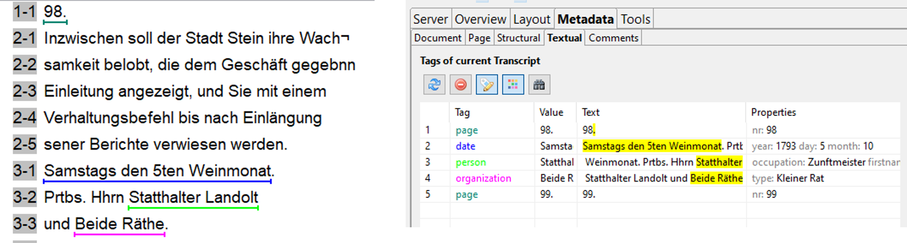

## Tools

Das Staatsarchiv hat für diese Zwecke folgende Tools entwickelt:
###  Transkribus Schnittstelle
Mit der Schnittstelle zur Plattform Transkribus wird Text aus Textregionen in Tabellen exportiert und nach der Bearbeitung wieder importiert.
Die lokale Version liegt auf einem öffentlichen [Github-Repository](https://github.com/stazh/TranskribusAPI).

  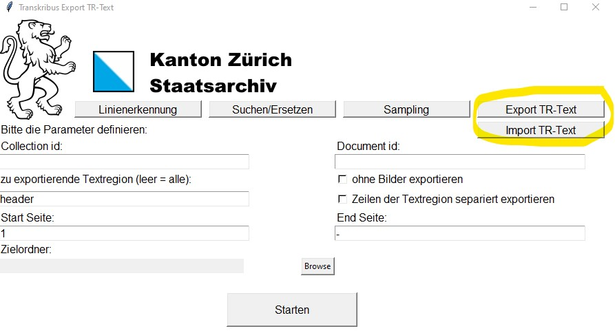

Mittlerweile gibt es eine Webversion: [https://stazhtranskribuswebapi.streamlit.app/](https://stazhtranskribuswebapi.streamlit.app/)

###  VBA Makro für einen Reiter "Ratsmanuale" in Excel
Mit dem VBA-Makro *Ratsmanuale.xlam* werden die exportierten Daten pro Band semitautomatisch kuratiert, angereichert und für den Wiederimport auf Transkribus und die Ablage aufbereitet.

  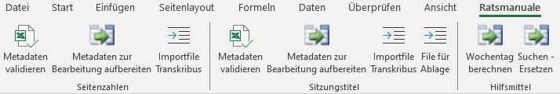

###  VBA Makro "Metadatan zusammenfügen"

Mit einem weiteren VBA Makro werden die aufbereiteten Metadaten pro Band zu einer Datei zusammengefügt und für den Import ins Archivinformationssystem aufbereitet.

## Vorgehen

Mit diesen Tools können wir nun die Sitzungstitel-Daten mit folgenden Arbeitsschritten semiautomatisch aufbereiten:

### 1. Originalseitenzahlen korrigieren

Als erstes wir die Originalseitenzahlen korrigieren, damit Start- und Endseite der einzelnen Sitzungen automatisch berechnet werden können (diese werden Bestandteil der Signatur). Das geht üblicherweise relativ einfach und grösstenteils automatisch: 

1. Seitenzahl-Textregionen aus Transkribus exportieren
2. Seitenzahlen in Excel automatisch aufnummerieren
3. Korrigierte Seitenzahl-Textregionen in Transkribus reimportieren

In seltenen Fällen ist die Seitennummerierung fehlerhaft im Original, wie folgendes Beispiel zeigt: 

  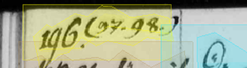

Diese Fälle müssen wir manuell erfassen. 

### 2. Textkorrektur (manuell)
Nach einem Export aller Sitzungstitel gehen wir den Text kurz durch und machen allenfalls ein paar kleinere manuelle Korrekturen. Die automatische Texterkennung funktioniert aber gerade bei den Sitzungstiteln sehr gut, da die Textelemente sehr häufig sind.

  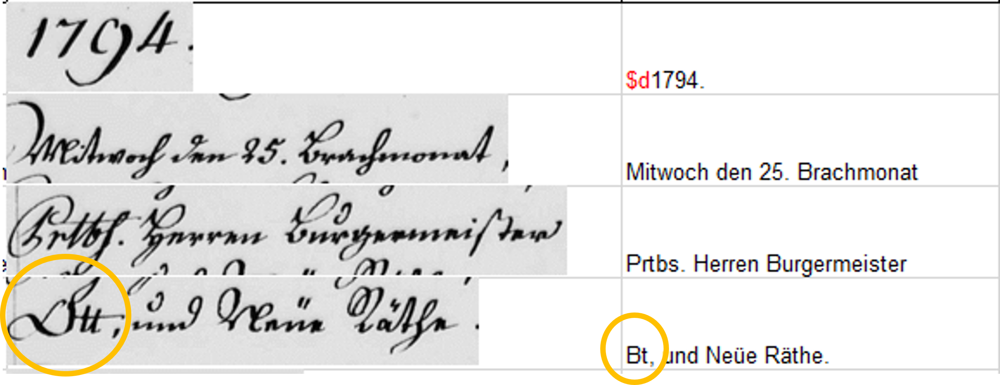

### 3. Tagging und Textkorrektur (automatisch)

Serielle Textkorrekturen und das Tagging können wir grösstenteils automatisch vornehmen. Im Ratsmanual-Makro haben wir eine Hilfsmittel implementiert, das gemäss einer Liste automatische Ersetzungen vornimmt. Diese Liste kann stetig ergänzt und angepasst werden.

*Liste mit automatischen Ersetzungen:*

  
  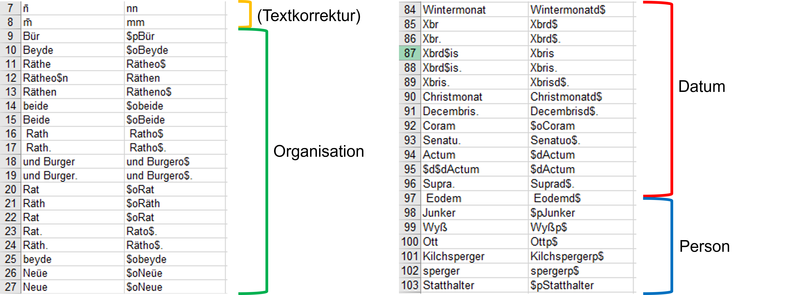

*Resultat nach den automatisierten Ersetzungen:*

  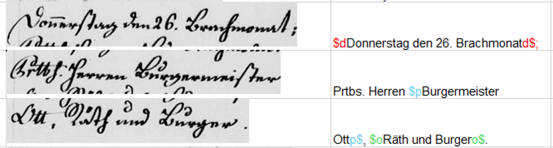

### 4. Metadaten mit Normdaten ergänzen (semiautomatisch)

### 5. Verschiedene Ausgabeformate generieren (automatisch)

