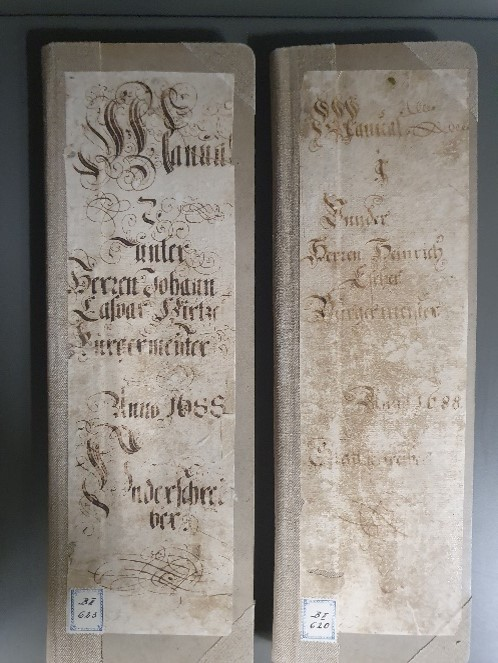

# Semiautomatische Aufbereitung der Sitzungstitel in den Zürcher Ratsmanualen

Inhaltsverzeichnis

-   [Projekt Ratsmanuale](#projekt-ratsmanuale)
-   [Sitzungstitel̈](#sitzungstitel)
-   [Ziele](#ziele)
-   [Tools](#tools)
-   [Vorgehen](#vorgehen)
  

## Projekt Ratsmanuale

  
  
  
  

Die Zürcher Ratsmanuale beinhalten die Protokolle der Ratssitzungen der Obrigkeit des alten Stadtstaats Zürich (1484 - 1798). Das Projekt Ratsmanuele startete 2019 als Pilot in der Abteilung Nacherschliessung und Digitalisierung des Staatsarchivs Zürich, um

- einen zentralen Bestand der frühen Neuzeit in Zürich für die historische Forschung und der interessienten Öffentlichkeit im Volltext online zur Verfügung zu stellen.
- die neuen Möglichkeiten mit KI bzw. automatischer Handschriftenerkennung (HTR) mit [Transkribus](https://www.transkribus.org/de) zu erproben.
- Methoden und Scripts bzw. Best Practices zu entwickeln, die auf weitere Projekte in der Abteilung Nacherschliessung und Digitalisierung des Staatsarchivs des Kantons Zürich übertragen werden können.

Am Ende des Pilotprojekts 2022 konnten sämtliche Protokolle des 18. Jahrhunderts publiziert werden. 2023 startete die Aufbereitung der restlichen Ratsmanual-Bände - nun als reguläres Projekt.

[Hier](https://ratsmanuale-zuerich.transkribus.eu/) geht es zum Portal, auf welchem du auch noch weitere Informationen zum Projekt findest. 

## Sitzungstitel

Eine Auswertung der Bände ergab, dass die Schreiber während über 300 Jahre bei der Aufzeichnung der Sitzungstitel ein und dieselbe Konvention beizubehalten schienen: 

🔴 1. Datum der Sitzung
  
🔵 2. Vorsitzender

🟢 3. tagendes Gremium

Hier Beispiele aus dem ersten, letzten und einem weiteren Band:

  <table>
    <tr>
      <td style="border: 2px solid black;">
        
      </td>
    </tr>
  </table>

## Ziele

Wir möchten...
1. die Ratsmanuale im Archivkatalog zusätzlich auf Stufe Sitzung erschliessen.
2. strukturierte und standardisierte Daten erhalten und diese als OGD zur Verfügung stellen.
3. die Daten mit Normdaten wie der [Gemeinsamen Normdatei](https://www.dnb.de/DE/Professionell/Standardisierung/GND/gnd_node.html) anreichern.

Konkret wollen wir am Schluss folgende Daten erhalten:

  

## Tools

Das Staatsarchiv hat für diese Zwecke zwei Tools entwickelt. Einerseits eine Schnittstelle zur Plattform Transkribus, mit welcher sich Text aus Transkribus exportieren und importieren lässt. Andererseits ein VBA-Makro, um die Daten semiautomatisch zu kuratieren und anzureichern. 

  
  

## Vorgehen

